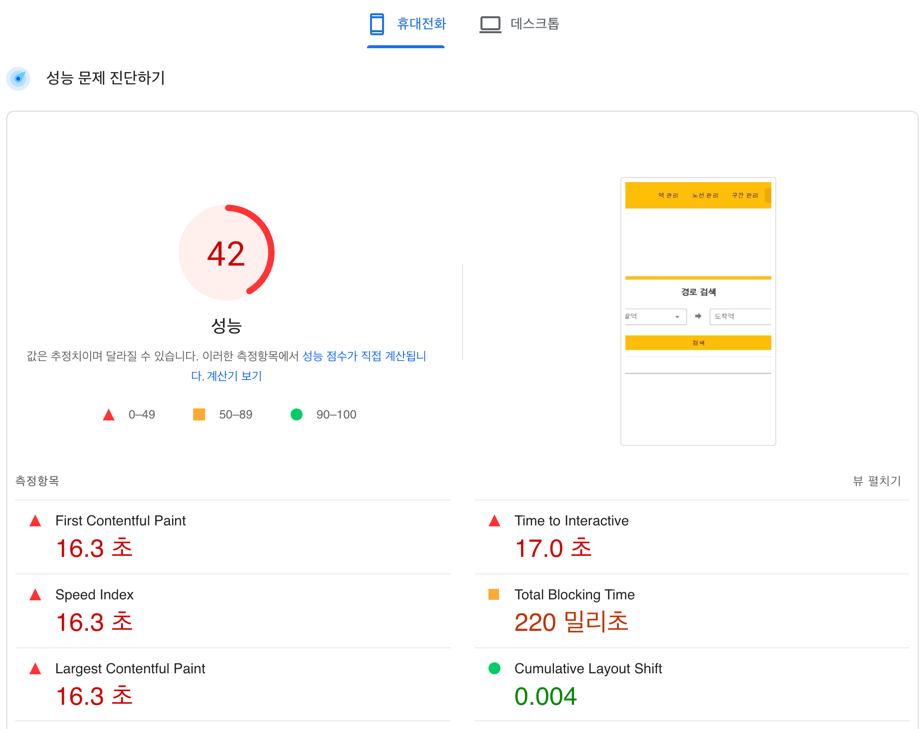
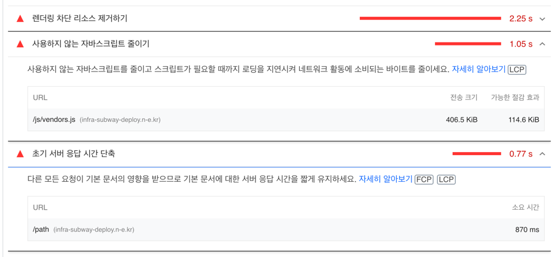
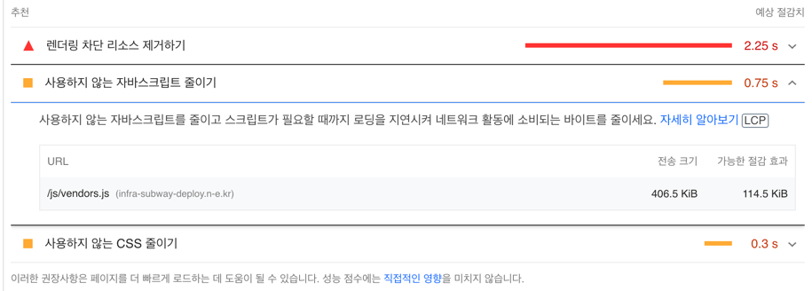

<p align="center">
    
</p>
<p align="center">
  
  
  <a href="https://edu.nextstep.camp/c/R89PYi5H" alt="nextstep atdd">
    
  </a>
  
</p>

<br>

# 인프라공방 샘플 서비스 - 지하철 노선도

<br>

## 🚀 Getting Started

### Install
#### npm 설치
```
cd frontend
npm install
```
> `frontend` 디렉토리에서 수행해야 합니다.

### Usage
#### webpack server 구동
```
npm run dev
```
#### application 구동
```
./gradlew clean build
```
<br>


### 1단계 - 화면 응답 개선하기
1. 웹 성능예산은 어느정도가 적당하다고 생각하시나요. 이 때, 서버 목표 응답시간은 어떻게 되나요?

`A. 예비 분석`

- 대상 페이지 : **경로 검색**
  - 역/노선/구간 관리, 로그인 페이지보다 **경로 검색** 페이지의 수요가 많을 것으로 생각
  - 참고: 언론보도
    - [데이터로보는 서울시 대중교통 이용](https://www.bigdata-map.kr/datastory/traffic/seoul)
    - [길찾기만 하루 1억건](https://news.mt.co.kr/mtview.php?no=2021090916014079809)

- 대상 환경: **mobile**
  - 지도앱 이용자 수로 보아 모바일 환경의 접속 수요가 많을 것으로 생각
  - 참고: 
    - [카카오 모바일 APP 현황](https://ko.lab.appa.pe/2016-09/kakao-korea.html)
    - [네이버 지도 MAU](https://blog.naver.com/rkwkrhspm/222515422896)

- 현 성능 지표 (Rule,Time based Metric)
  - 테스트 url: https://infra-subway-deploy.n-e.kr/path
  - 참고 툴: PageSpeed

```aidl
    - 성능점수 : 42
    - FCP    : 16.3초
    - TTI    : 17.0초
    - SI     : 16.3초
    - TBT    : 220밀리초
    - LCP    : 16.3초   
    - CLS    : 0.004
```
- 
  <details>
  <summary> pagespeed 결과 </summary>
  <div markdown="1">
    
  
  </div>
  </details> 

`B. 경쟁사 분석`
- (경쟁사) 카카오맵 성능지표
  - 테스트 페이지: [카카오맵경로검색](https://m.map.kakao.com/actions/publicRoute?startLoc=%EC%9D%98%EC%A0%95%EB%B6%80%EC%97%AD+1%ED%98%B8%EC%84%A0&sxEnc=MNNLNR&syEnc=QNQRPML&endLoc=%EC%9E%A5%EC%A7%80%EC%97%AD+8%ED%98%B8%EC%84%A0&exEnc=MMQTLL&eyEnc=QNNPOPN&ids=P21160452%2CP21161044&service=) 
```aidl
    - 성능점수 : 77
    - FCP    : 1.7초 
    - TTI    : 6.0초
 ```
- 
    <details>
    <summary> pagespeed 결과 </summary>
    <div markdown="1">
    
    
    </div>
    </details>


- (경쟁사) 네이버지도 성능지표
  - 테스트 페이지: [네이버지도경로검색](https://m.map.naver.com/subway/subwayPath.naver?region=1000&departureId=111&arrivalId=819&pathType=1) 
```aidl
    - 성능점수 : 64
    - FCP    : 2.2초 
    - TTI    : 4.1초
 ``` 

- 
    <details>
    <summary> pagespeed 결과 </summary>
    <div markdown="1">
    
    
    </div>
    </details>

- => 경쟁사들 대비 응답시간이 20% 이상 차이남.

`C. 성능 기준 설정`
- 기준 페이지 : 경로 검색
- 기준 환경 : 모바일 
- 시간 기반 성능 기준
  - 페이지로드 3초 미만
  - TTI 5초 미만


2. 성능 개선 결과를 공유해주세요

| 조치       | FCP   | TTI   |
|----------|-------|-------|
| 초기       | 16.3초 | 17.0초 |
| gzip     | 6.9초  | 7.3초  |
| cache    | 7.0초  | 7.4초  |
| cache 원복 | 6.9초  | 7.3초  |

3. 어떤 부분을 개선해보셨나요? 과정을 설명해주세요

reverse proxy (/etc/nginx/nginx.conf) 변경

  - gzip 압축 활성화 -> FCP, TTI 감소
  - cache 설정 -> FCP, TTI 소폭 증가
    - (?) 응답 시간 증가한 이유를 모르겠음~
    - pagespeed는 항상 최초 요청을 기준으로 검사하기 때문일까?
    <details>
    <summary> pagespeed 추천 조치 사항 </summary>
    <div markdown="1">

    
    </div>
    </details>

  - 그래서 cache 원복
    <details>
    <summary> pagespeed 추천 조치 사항 </summary>
    <div markdown="1">

    
    </div>
    </details>


  - http2.0과 이전버전도 비교해보고 싶었으나 이미 설정되어 있어 패스 


---

### 2단계 - 부하 테스트 
1. 부하테스트 전제조건은 어느정도로 설정하셨나요

2. Smoke, Load, Stress 테스트 스크립트와 결과를 공유해주세요

---

### 3단계 - 스케일 아웃

1. Launch Template 링크를 공유해주세요.

2. cpu 부하 실행 후 EC2 추가생성 결과를 공유해주세요. (Cloudwatch 캡쳐)

```sh
$ stress -c 2
```

---

### [추가] 로깅, 모니터링
1. 각 서버내 로깅 경로를 알려주세요

2. Cloudwatch 대시보드 URL을 알려주세요
---

### [추가] WAS 개선하기
1. 성능 개선 결과를 공유해주세요 (Smoke, Load, Stress 테스트 결과)

2. 어떤 부분을 개선해보셨나요? 과정을 설명해주세요
